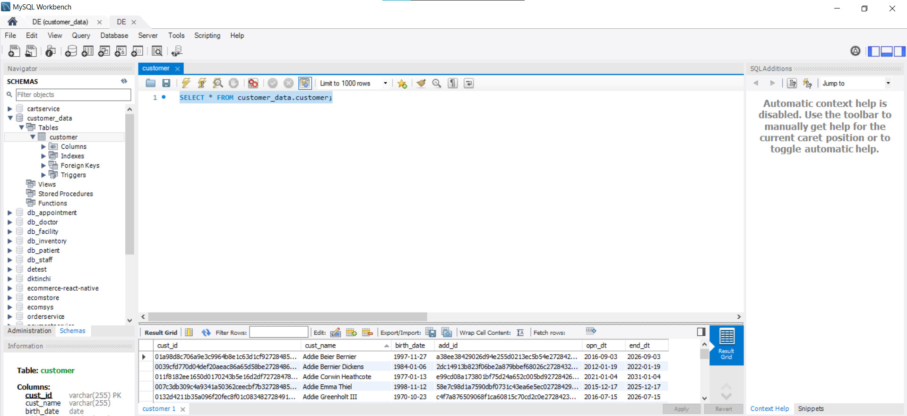
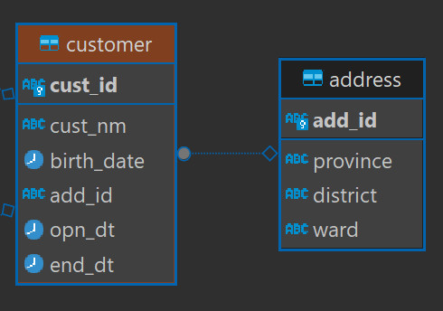

# ETL Project 

## Introduction
Repo này lưu trữ toàn bộ data, source code cho dự án tìm hiểu và thực hành sử dụng Python để ETL dữ liệu về ngày sinh của người dùng trong hệ thống ngân hàng, lưu trữ toàn bộ source code và data lên trên AWS S3. Cuối cùng, QuickSight được sử dụng để trực quan hóa dữ liệu, tạo điều kiện cho việc phân tích và ra quyết định sau này dễ dàng hơn. 

## Technologies
+ Python, Pandas, Boto3
+ MySQL
+ AWS (S3, QuickSight)

## Process overview

Trước khi thiết lập, chúng ta cần có nguồn dữ liệu. Ở đây, tôi sử dụng các dữ liệu mà tôi đã có trước đây mà tôi đã lưu trong MySQL. Các bản ghi này tạo thành một bảng chứa thông tin về ngày sinh của các khách hàng, cụ thể với các thuộc tính:
+ `cust_id`: chứa id của mỗi người dùng.
+ `cust_name`: chứa thông tin về tên của các người dùng.
+ `birth_date`: chứa thông tin về ngày sinh của người dùng.
+ `add_id`: chứa id về địa chỉ của người dùng.
+ `opn_dt`
+ `end_dt`
Dữ liệu trong MySQL:

Sơ đồ quan hệ thực thể như sau:

extract_data.py giúp tôi trích xuất dữ liệu ra, transform lại về định dạng ngày sinh và load_to_s3.py giúp toàn bộ source code và data được đẩy lên Amazon S3. Trong đó dữ liệu được trích xuất ở customer_data_extract_2000 để trực quan hóa (vì tài khoản cá nhân sử dụng miễn phí nên QuickSight bị giới hạn kích thước đọc file) 

## Set up trên AWS Cloud
Đầu tiên, cần phải có tài khoản AWS Cloud để thực hiện dự án này. Quy trình đăng ký [tại](https://repost.aws/knowledge-center/create-and-activate-aws-account). Sau khi hoàn tất, sẽ có tài khoản miễn phí với một số dịch vụ.

LƯU Ý QUAN TRỌNG: Sau khi tạo tài khoản AWS, bạn sẽ có quyền truy cập root. Tuy nhiên, không nên sử dụng điều này. Thay vào đó, nên một tài khoản IAM mới với các quyền và quốc gia phù hợp.

1. Tạo folder S3: trên giao diện S3, tạo đường dẫn lưu trữ tệp s3://customerdataetl/
2. Upload toàn bộ souce code và dữ liệu lên bằng load_to_s3.py
3. Trực quan hóa bằng QuickSight

Và đây cũng là kết thúc của dự án, mặc dù vẫn còn nhiều hạn chế và quy mô nhỏ. Một lần nữa, xin cảm ơn các bạn đã theo dõi.